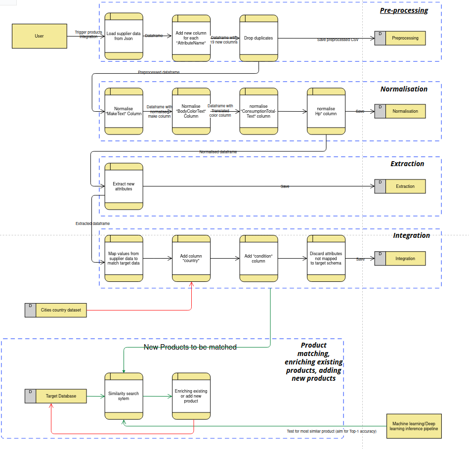

# Supplier data Products integrator

A python package for integrating and help onboarding new suppliers efficiently.


## Usage Examples

To use the `integrator`, start by setting up the environment and the package, then use the python API or the CLI scripts to generate the different CSV files.

### Setup the Environment and the Package

- Setup directly on the host (optionally using `venv`):
  ```bash
  virtualenv venv
  source venv/bin/activate
  pip install -r requirements.txt
  pip install .
  ```


### Run the product integrator

- Run the CLI script `product_integrator` to generate differnt CSVs:
  ```bash
  product_integrator --task integration --output_path "./data/output/"
  ```

  -  CSVs will be saved under `output_path/%Y%m%d-%H%M%S`

  - `task` argument is used to limit the execution to certain tasks only, meaning if `task = "integration"`, then the pipeline will run all steps starting from **preprocessing** to **normalisation** then **extraction** then **integration**, and if `task = normalisation"` then just **preprocessing** and **normalisation** will run. 
     


## Repository Structure

The codebase is structured as follows:

```bash
.  
├── data
|-- input                                # input Data folder
|   |-- Target\ Data.xlsx
|   |-- external
|   |   `-- geonames-all-cities-with-a-population-1000.json
|   `-- supplier_car.json
`-- output              
├── products_integrator/                # package source
|-- __init__.py
|-- constants.py                        # Constant file for fixed static variables
|-- extraction.py                       # Extraction task
|-- integration.py                      # Integration task
|-- main.py                             # CLI package entrypoint
|-- normalisation.py                    # Normalisation task
|-- pipeline
|   |-- __init__.py
|   |-- data.py
|   |-- transformations.py              # Different transformation methods
|   |-- user_defined_fns.py
|   `-- utils.py
|-- preprocessing.py                    # preprocessing task
`-- version.py                          # package version
│
├── .gitignore
├── .pre-commit-config.yaml
│
├── requirements.txt                    # package dependencies
├── setup.py                            # package setup script
│
├── CONTRIBUTING.md
└── README.md
```


## Data flow 



## Product matching, enriching existing products, adding new products

1. Prequisites: 
    - A target Database
    - New Products to integrate

2. Test product similarity
  Approaches:
    - `Deep Metric Learning`, eg: [BERT](https://aclanthology.org/2020.ecomnlp-1.7.pdf) , 
      - Advantages: This has proved to have Good Performance across complex problems.
      - Potential issues: Model is so big and needs a large amount of resources
    - `Deep learning model` which takes in the two product names and model type and computes a `similarity` score: 
      - Advantages: Won't take much resources
      - Disadvantages: Won't work on products with different spellings

3. `If` product matches existing one:
     We enrich existing products with attributes that exists in the new product and are missing from the target database
   `Else` We add new product to the target database
              
4. Deep learning model is trained continuously on the Target database and best model checkpoint is saved. When new products come, we use the latest checkpoint to run the inference pipeline.

## Extra

1. To map cities to their corresponding country code, we used an external database downloaded from: [geonames-all-cities-with-a-population-1000](https://public.opendatasoft.com/explore/dataset/geonames-all-cities-with-a-population-1000)

3. For cities that are available but with different spelling, we integrated: [thefuzz](https://github.com/seatgeek/thefuzz), 
which is string matching library that uses Levenshtein Distance to calculate the differences between sequences. we take subset of the matching cities and we only consider the city to be `same` only if if it has a similarity of `> 80%`, we take the city with greater score.

  - **eg: This proved useful for "St. Gallen" which is written "sankt gallen" in the Cities dataset**

2. To translate color from German to english we used: [deep-translator](https://pypi.org/project/deep-translator/)